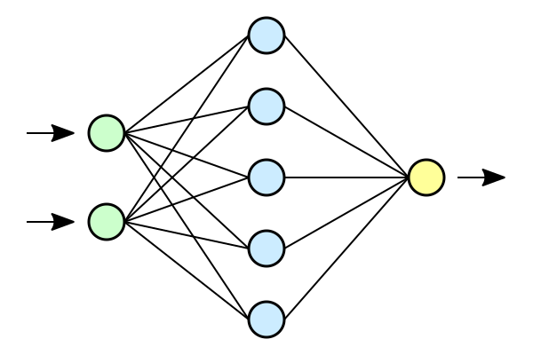

# Neural Networks



### Perceptron:

-   A perceptron is a fundamental unit in artificial neural networks (ANNs), acting as a simple mathematical function.
-   Denoted as $k$, it processes $m + 1$ inputs ($x_0$ to $x_m$) with corresponding weights ($w_{k0}$ to $w_{km}$).
-   The $x_0$ input serves as a bias input with $w_{k0} = b_k$, simplifying the representation.

### Perceptron Output:

-   The output ($y_k$) of the $k$-th neuron is determined by the transfer function $\varphi$.
-   Mathematically, $y_k = \varphi\left(\sum_{j=0}^{m} w_{kj}x_j\right)$.
-   The transfer function $\varphi$ introduces non-linearity, allowing neural networks to learn complex patterns.

### Neural Network Structure:

-   Neural networks consist of layers: an input layer, hidden layers, and an output layer.
-   The input layer receives initial data, hidden layers process information, and the output layer produces predictions.
-   Neurons in each layer are interconnected with weights, which are adjusted during the learning process.

### Learning Process:

1. **Weights and Gradients Initialization:**

    - Initialize weights appropriately; improper initialization may lead to slow convergence or convergence to suboptimal solutions.
    - Gradients represent the sensitivity of the loss function to changes in weights.

2. **Forward Propagation:**

    - Inputs are fed forward through the network, reaching the output layer.
    - Weighted sums of inputs are computed at each neuron, and the transfer function is applied.
    - Mathematically, $z_k = \sum_{j=0}^{m} w_{kj}x_j$, and $y_k = \varphi(z_k)$.

3. **Output Activation:**

    - Activation functions introduce non-linearity to the output layer.
    - Common activation functions include sigmoid ($\sigma$), tanh, and ReLU.
    - Mathematically, $a_k = \varphi(z_k)$, where $a_k$ is the activated output.

4. **Loss Calculation:**

    - Compare the predicted output to the actual output using a loss function.
    - The loss quantifies the disparity between predictions and ground truth.
    - For example, Mean Squared Error (MSE) is often used: $L = \frac{1}{2}(a_k - y_{\text{true}})^2$.

5. **Backward Propagation and Weight Update:**
    - Gradients are calculated using the chain rule during backpropagation.
    - Weights are updated using gradient descent to minimize the loss.
    - Mathematically, $\frac{\partial L}{\partial w_{kj}} = \frac{\partial L}{\partial a_k} \cdot \frac{\partial a_k}{\partial z_k} \cdot \frac{\partial z_k}{\partial w_{kj}}$.
    - Update rule: $w_{kj} \leftarrow w_{kj} - \alpha \frac{\partial L}{\partial w_{kj}}$, where $\alpha$ is the learning rate.

```python
import numpy as np
import matplotlib.pyplot as plt

class Perceptron:
    def __init__(self, input_size, learning_rate=0.01):
        self.weights = np.random.rand(input_size + 1)
        self.learning_rate = learning_rate

    def activation_function(self, x):
        return 1 if x >= 0 else 0

    def predict(self, inputs):
        inputs = np.insert(inputs, 0, 1)  # Insert bias term
        summation = np.dot(self.weights, inputs)
        return self.activation_function(summation)

    def train(self, inputs, target):
        prediction = self.predict(inputs)
        error = target - prediction
        inputs = np.insert(inputs, 0, 1)  # Insert bias term
        self.weights += self.learning_rate * error * inputs


class PerceptronLayer:
    def __init__(self, input_size, num_neurons, learning_rate=0.01):
        self.perceptrons = [Perceptron(input_size, learning_rate) for _ in range(num_neurons)]

    def predict(self, inputs):
        return np.array([perceptron.predict(inputs) for perceptron in self.perceptrons])

    def train(self, inputs, target):
        for perceptron, target_value in zip(self.perceptrons, target):
            perceptron.train(inputs, target_value)


class NeuralNetwork:
    def __init__(self, input_size, hidden_size, output_size, learning_rate=0.01):
        self.hidden_layer = PerceptronLayer(input_size, hidden_size, learning_rate)
        self.output_layer = PerceptronLayer(hidden_size, output_size, learning_rate)

    def train(self, inputs, target):
        hidden_output = self.hidden_layer.predict(inputs)
        self.output_layer.train(hidden_output, target)

    def predict(self, inputs):
        hidden_output = self.hidden_layer.predict(inputs)
        return self.output_layer.predict(hidden_output)


def plot_decision_boundary(network, x_range, y_range):
    xx, yy = np.meshgrid(np.linspace(x_range[0], x_range[1], 100), np.linspace(y_range[0], y_range[1], 100))
    predictions = np.array([network.predict(np.array([x, y])) for x, y in zip(xx.ravel(), yy.ravel())])
    predictions = predictions.reshape(xx.shape)

    plt.contourf(xx, yy, predictions, cmap=plt.cm.Spectral, alpha=0.8)
    plt.scatter(data[:, 0], data[:, 1], c=labels, cmap=plt.cm.Spectral)
    plt.show()


if __name__ == "__main__":
    # Example usage for XOR problem
    data = np.array([[0, 0], [0, 1], [1, 0], [1, 1]])
    labels = np.array([0, 1, 1, 0])

    input_size = 2
    hidden_size = 4
    output_size = 1

    nn = NeuralNetwork(input_size, hidden_size, output_size, learning_rate=0.1)

    # Train the neural network
    for epoch in range(10000):
        for example, label in zip(data, labels):
            nn.train(example, label)

    # Plot decision boundary
    plot_decision_boundary(nn, [0, 1], [0, 1])

```

More complex example

```python
import numpy as np
import matplotlib.pyplot as plt
from sklearn import datasets
from sklearn.model_selection import train_test_split
from sklearn.preprocessing import StandardScaler
from sklearn.metrics import accuracy_score

class Perceptron:
    def __init__(self, input_size, learning_rate=0.01):
        self.weights = np.random.rand(input_size + 1)
        self.learning_rate = learning_rate

    def relu(self, x):
        return np.maximum(0, x)

    def softmax(self, x):
        exp_values = np.exp(x - np.max(x, axis=-1, keepdims=True))
        return exp_values / np.sum(exp_values, axis=-1, keepdims=True)

    def predict(self, inputs):
        inputs = np.insert(inputs, 0, 1)  # Insert bias term
        hidden_output = self.relu(np.dot(self.weights, inputs))
        return self.softmax(hidden_output)

    def train(self, inputs, target):
        prediction = self.predict(inputs)
        error = target - prediction
        inputs = np.insert(inputs, 0, 1)  # Insert bias term
        gradient = np.dot(error, inputs)
        self.weights += self.learning_rate * gradient

class PerceptronLayer:
    def __init__(self, input_size, num_neurons, learning_rate=0.01):
        self.perceptrons = [Perceptron(input_size, learning_rate) for _ in range(num_neurons)]

    def predict(self, inputs):
        return np.array([perceptron.predict(inputs) for perceptron in self.perceptrons])

    def train(self, inputs, target):
        for perceptron, target_value in zip(self.perceptrons, target):
            perceptron.train(inputs, target_value)

class NeuralNetwork:
    def __init__(self, input_size, hidden_size, output_size, learning_rate=0.01):
        self.hidden_layer = PerceptronLayer(input_size, hidden_size, learning_rate)
        self.output_layer = PerceptronLayer(hidden_size, output_size, learning_rate)

    def train(self, inputs, target):
        hidden_output = self.hidden_layer.predict(inputs)
        self.output_layer.train(hidden_output, target)

    def predict(self, inputs):
        hidden_output = self.hidden_layer.predict(inputs)
        return self.output_layer.predict(hidden_output)

def one_hot_encode(labels, num_classes):
    one_hot_labels = np.zeros((len(labels), num_classes))
    one_hot_labels[np.arange(len(labels)), labels] = 1
    return one_hot_labels

def plot_decision_boundary(network, data, labels, title):
    h = .02
    x_min, x_max = data[:, 0].min() - 1, data[:, 0].max() + 1
    y_min, y_max = data[:, 1].min() - 1, data[:, 1].max() + 1
    xx, yy = np.meshgrid(np.arange(x_min, x_max, h), np.arange(y_min, y_max, h))

    Z = np.argmax(np.array([network.predict(np.array([x, y])) for x, y in zip(xx.ravel(), yy.ravel())]), axis=1)
    Z = Z.reshape(xx.shape)

    plt.contourf(xx, yy, Z, cmap=plt.cm.Spectral, alpha=0.8)
    plt.scatter(data[:, 0], data[:, 1], c=labels, cmap=plt.cm.Spectral)
    plt.title(title)
    plt.show()

def main():
    # Load Iris dataset
    iris = datasets.load_iris()
    data = iris.data[:, :2]  # Use only the first two features for simplicity
    labels = iris.target

    # Standardize the features
    scaler = StandardScaler()
    data = scaler.fit_transform(data)

    # Split the dataset into training and testing sets
    X_train, X_test, y_train, y_test = train_test_split(data, labels, test_size=0.2, random_state=42)

    num_classes = len(np.unique(labels))
    y_train_encoded = one_hot_encode(y_train, num_classes)

    input_size = X_train.shape[1]
    hidden_size = 8
    output_size = num_classes

    nn = NeuralNetwork(input_size, hidden_size, output_size, learning_rate=0.01)

    # Train the neural network
    for epoch in range(5000):
        for example, label in zip(X_train, y_train_encoded):
            nn.train(example, label)

    # Make predictions on the test set
    y_pred_encoded = np.array([nn.predict(example) for example in X_test])
    y_pred = np.argmax(y_pred_encoded, axis=1)

    # Evaluate accuracy
    accuracy = accuracy_score(y_test, y_pred)
    print(f"Accuracy: {accuracy}")

    # Plot decision boundary
    plot_decision_boundary(nn, X_test, y_test, "Decision Boundary for Iris Classification")

if __name__ == "__main__":
    main()

```
