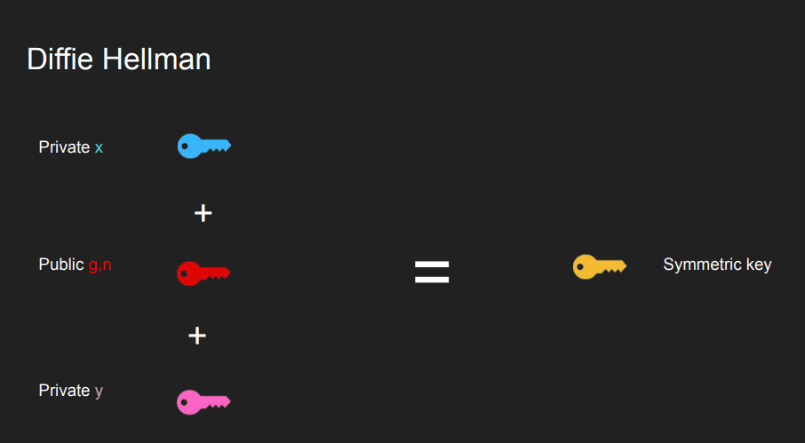
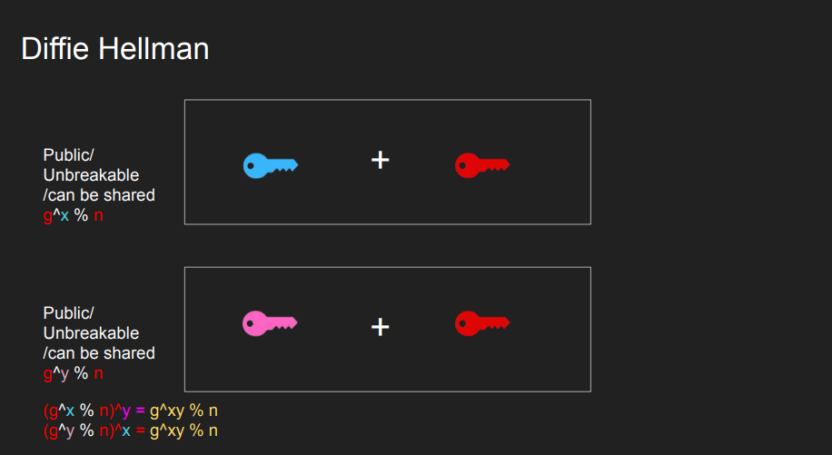

## Slides

[Slides](files/networking-concepts/Fundamentals+of+Networking+for+Effective+Backends-v5.pdf) from [Hussein Nasser's Networking Course](https://www.udemy.com/course/fundamentals-of-networking-for-effective-backend-design/)

## Standard communication models for Networking

A standard model allows decoupling, so that the layers can be worked on or upgraded without worrying about the rest.

### OSI (Open Systems Interconnect) Model

[OSI (Open Systems Interconnect) Model](https://en.wikipedia.org/wiki/OSI_model)

7 Layers each describe a specific networking component

-   Layer 7 - Application - HTTP/FTP/gRPC
-   Layer 6 - Presentation - Encoding, Serialization
-   Layer 5 - Session - Connection establishment, TLS
-   Layer 4 - Transport - UDP/TCP
-   Layer 3 - Network - IP
-   Layer 2 - Data link - Frames, Mac address Ethernet
-   Layer 1 - Physical - Electric signals, fiber or radio waves

### The TCP/IP Model or Internet Protocol Suite

[The TCP/IP Model or Internet Protocol Suite](https://en.wikipedia.org/wiki/Internet_protocol_suite)

Much simpler than OSI, just 4 layer

-   Application (Layer 5, 6 and 7)
-   Transport (Layer 4)
-   Internet (Layer 3)
-   Data link (Layer 2)

Physical layer is not officially covered in the model

## Data Link Layer

### ARP (Address Resolution Protocol)

It is used to translate IP addresses to MAC addresses, since IPs are changeable and MAC addresses are (usually) fixed. ARP is local.

[tcpdump](https://www.tcpdump.org/manpages/tcpdump.1.html)

-   `tcpdump -n -i wlp3s0 arp`

`tcpdump` with src and dst filters:

-   `tcpdump -n -v -i wlp3s0 src 192.168.1.2 or dst 142.243.66.23`

To deliver the packet to the destination host, the source IP, destination IP, source MAC address, and destination MAC address should be known. Some basic rules for the packet flow:

-   If the destination host is present in the same network, then the packet is delivered directly to the destination host.
-   If the destination host is present in a different network, then the packet is delivered to the default gateway first which in turn delivers the packet to the destination host.
-   If ARP is not resolved then ARP will be resolved first.
-   MAC address never crosses its broadcast domain.

### Host to Host Communication

Finding a device with a unique MAC address in a network is done by sending requests to all devices in the network. Only the device with the intended MAC address accepts the connection. But when the network is of a bigger scale than a simple home network, this method is not possible to scale. This is where IP addresses and routers come into play. Routers have two different IP addresses for the two networks they are connecting. When sending an IP packet (layer 3, router) there is a process of AND (\&)ing with the subnet mask to find out if the packet is destined to the same network or another, and passing forward until the TTL of the packet goes to zero or the destination is found.

**TTL - Time to Live** - this gives the count of how many hops a packet can survive. **TTL** is decreased by 1 every hop. TTL is needed because without it the packets might hop from router to router indefinitely.

_Note [Optimization]_ Keeping your server and database in the same subnet will be more efficient than those two being in separate subnets. Because the subnets are usually connected by a router (the routers live in both networks), if the router is congested, we are gonna see delays. Instead, we can use a switch in between the database and the backend.

## Network Layer / Internet Layer

[IP](https://en.wikipedia.org/wiki/Internet_Protocol) is the network layer communications protocol.

IP Addresses are a layer 3 property. Can be set automatically or statically, has **network** and **host** portions. 4 bytes in IPv4 - 32 bits.

-   a.b.c.d/x (a, b, c, d, x are integers). x is the network bits, remaining are the host. [CIDR Notation](https://en.wikipedia.org/wiki/Classless_Inter-Domain_Routing)

### ICMP (Internet Control Message Protocol)

It is used by network devices, including routers, to send error messages and operational information indicating success or failure when communicating with another IP address. It is used by ping and traceroute.

-   `ping google.com`
-   `traceroute google.com`
-   `tcpdump -n -i wlp3s0 icmp`

## Transport Layer

### [UDP (User Datagram Protocol)](https://en.wikipedia.org/wiki/User_Datagram_Protocol)

Layer 4 protocol, sits on top of the IP protocol (Network layer). While IP can address a host using IP addresses, UDP has the ability to address processes in a host using ports. Simpler and stateless protocol, compared to TCP. Has 8-byte header on top of 20 bytes of the IP packet. Used for:

-   Video Streaming
-   VPN
-   DNS
-   WebRTC uses UDP. Websockets, on the other hand, use TCP
-   Games
-   P2P

Multiplexing (many to one) and demultiplexing (one to many). IP targets hosts only. Each host can have multiple applications running. Ports can be used to identify the 'apps' or 'processes'. The sender multiplexes all inputs into single IP packets into UDP, and the receiver demultiplexes UDP datagrams in IP packets to each app or process. A four-tuple (Source IP, Source Port, Destination IP, Destination Port) can represent every communication between two devices.

_Note_ Every time there is a mapping like in DNS, ARP tables, there's a chance of poisoning - ARP poisoning, DNS poisoning.

_Note_ Because we have 65535 ports, we can have a maximum of 65535 connections (theoretically) between a client IP and a single server process assuming the client uses all its ports to connect to the server process. Practically though, some of the ports are already reserved.

Capturing DNS server requests and responses using `tcpdump`:

-   `nslookup google.com 8.8.8.8`
-   `tcpdump -n -v -i wlp3s0 src 8.8.8.8 or dst 8.8.8.8`

```
tcpdump: listening on wlp3s0, link-type EN10MB (Ethernet), snapshot length 262144 bytes

16:26:29.543518 IP (tos 0x0, ttl 64, id 17495, offset 0, flags [none], proto UDP (17), length 56)
    192.168.0.36.59200 > 8.8.8.8.53: 30104+ A? google.com. (28)

16:26:29.560006 IP (tos 0x0, ttl 121, id 35261, offset 0, flags [none], proto UDP (17), length 72)
    8.8.8.8.53 > 192.168.0.36.59200: 30104 1/0/0 google.com. A 172.217.169.14 (44)

16:26:29.560504 IP (tos 0x0, ttl 64, id 20170, offset 0, flags [none], proto UDP (17), length 56)
    192.168.0.36.36072 > 8.8.8.8.53: 1041+ AAAA? google.com. (28)

16:26:29.590092 IP (tos 0x0, ttl 120, id 2066, offset 0, flags [none], proto UDP (17), length 84)
    8.8.8.8.53 > 192.168.0.36.36072: 1041 1/0/0 google.com. AAAA 2a00:1450:4009:823::200e (56)
```

### [TCP (Transmission Control Protocol)](https://en.wikipedia.org/wiki/Transmission_Control_Protocol)

Similar to UDP, it's a Layer 4 protocol and can address processes in a host using ports. It 'controls' the transmission, unlike UDP which is like a firehose. Requires a connection before transmitting data. Connection is made using a 'handshake'. Hence it's stateful. Has 20 bytes header. Used for reliable communications like:

-   Remote Shell
-   Database Connections
-   Web Communications (HTTP1, HTTP2 is built on top of TCP, HTTP3 is built on top of QUIC which is built on top of UDP and aims to be better than TCP)
-   Any bidirectional communication

TCP Connection is a Layer 5 (session) concept. The connection between client and server must be there to send data, can't send data outside of a connection, requires a 3-way TCP handshake.

The connection is identified by four properties (Source IP, Source Port, Destination IP, Destination Port). These four properties are combined and hashed and saved as a file descriptor (also called sockets).

_Note_ Socket often refers specifically to an internet socket or TCP socket. An internet socket is minimally characterized by the following:

-   local socket address, consisting of the local IP address and (for TCP and UDP, but not IP) a port number
-   protocol: A transport protocol, e.g., TCP, UDP, raw IP. This means that (local or remote) endpoints with TCP port 53 and UDP port 53 are distinct sockets, while IP does not have ports.
-   A socket that has been connected to another socket, e.g., during the establishment of a TCP connection, also has a remote socket address.

The Transmission Control Protocol differs in several key features compared to the User Datagram Protocol:

-   **Ordered data transfer**: the destination host rearranges segments according to a sequence number
-   **Retransmission of lost packets**: any cumulative stream not acknowledged is retransmitted
-   **Error-free data transfer**: corrupted packets are treated as lost and are retransmitted
-   **Flow control**: limits the rate a sender transfers data to guarantee reliable delivery. The receiver continually hints the sender on how much data can be received (receiver sends an **ACK** with its window size [max 64KB but can be scaled up with the window scaling factor (0-14), so that window size can go up to 1GB]). When the receiving host's buffer fills, the next acknowledgment suspends the transfer and allows the data in the buffer to be processed. Employs a **window sliding mechanism**.
-   **Congestion control**: the receiver might handle the load but the middle boxes (routers) might not. lost packets (presumed due to congestion) trigger a reduction in data delivery rate

Capturing TCP segments with `tcpdump`:

-   `ping example.com`
-   `tcpdump -n -v -i wlp3s0 src 93.184.216.34 or dst 93.184.216.34 and port 80`
-   `curl example.com`

```
    tcpdump: listening on wlp3s0, link-type EN10MB (Ethernet), snapshot length 262144 bytes

15:47:30.859589 IP (tos 0x0, ttl 64, id 33813, offset 0, flags [DF], proto TCP (6), length 60)
    192.168.0.36.50584 > 93.184.216.34.80: Flags [S], cksum 0x8cea (correct), seq 3227649586, win 64240, options [mss 1460,sackOK,TS val 338897101 ecr 0,nop,wscale 7], length 0

15:47:30.962271 IP (tos 0x0, ttl 51, id 0, offset 0, flags [DF], proto TCP (6), length 60)
    93.184.216.34.80 > 192.168.0.36.50584: Flags [S.], cksum 0x314f (correct), seq 2019451891, ack 3227649587, win 65535, options [mss 1460,sackOK,TS val 2278814291 ecr 338897101,nop,wscale 9], length 0

15:47:30.962345 IP (tos 0x0, ttl 64, id 33814, offset 0, flags [DF], proto TCP (6), length 52)
    192.168.0.36.50584 > 93.184.216.34.80: Flags [.], cksum 0x5dc0 (correct), ack 1, win 502, options [nop,nop,TS val 338897204 ecr 2278814291], length 0

15:47:30.962544 IP (tos 0x0, ttl 64, id 33815, offset 0, flags [DF], proto TCP (6), length 126)
    192.168.0.36.50584 > 93.184.216.34.80: Flags [P.], cksum 0xcfb7 (correct), seq 1:75, ack 1, win 502, options [nop,nop,TS val 338897204 ecr 2278814291], length 74: HTTP, length: 74
        GET / HTTP/1.1
        Host: example.com
        User-Agent: curl/8.2.1
        Accept: */*

15:47:31.069298 IP (tos 0x0, ttl 51, id 40104, offset 0, flags [none], proto TCP (6), length 52)
    93.184.216.34.80 > 192.168.0.36.50584: Flags [.], cksum 0x5e81 (correct), ack 75, win 128, options [nop,nop,TS val 2278814398 ecr 338897204], length 0

15:47:31.070181 IP (tos 0x0, ttl 51, id 40105, offset 0, flags [none], proto TCP (6), length 1500)
    93.184.216.34.80 > 192.168.0.36.50584: Flags [.], cksum 0x417a (correct), seq 1:1449, ack 75, win 128, options [nop,nop,TS val 2278814398 ecr 338897204], length 1448: HTTP, length: 1448
        HTTP/1.1 200 OK
        Age: 187681
        Cache-Control: max-age=604800
        Content-Type: text/html; charset=UTF-8
        Date: Tue, 08 Aug 2023 14:47:30 GMT
        Etag: "3147526947+ident"
        Expires: Tue, 15 Aug 2023 14:47:30 GMT
        Last-Modified: Thu, 17 Oct 2019 07:18:26 GMT
        Server: ECS (nyb/1DCD)
        Vary: Accept-Encoding
        X-Cache: HIT
        Content-Length: 1256

        <!doctype html>
        <html>
        <head>
            <title>Example Domain</title>

            <meta charset="utf-8" />
            <meta http-equiv="Content-type" content="text/html; charset=utf-8" />
            <meta name="viewport" content="width=device-width, initial-scale=1" />
            <style type="text/css">
            body {
                background-color: #f0f0f2;
                margin: 0;
                padding: 0;
                font-family: -apple-system, system-ui, BlinkMacSystemFont, "Segoe     UI", "Open Sans", "Helvetica Neue", Helvetica, Arial, sans-serif;

            }
            div {
                width: 600px;
                margin: 5em auto;
                padding: 2em;
                background-color: #fdfdff;
                border-radius: 0.5em;
                box-shadow: 2px 3px 7px 2px rgba(0,0,0,0.02);
            }
            a:link, a:visited {
                color: #38488f;
                text-decoration: none;
            }
            @media (max-width: 700px) {
                div {
                    margin: 0 auto;
                    width: auto;
                }
            }
            </style>
        </head>
        <body>
        <div>
            <h1>Example Domain</h1>
            <p>This domain is for use in illustrative examples in documents. You may use this
            domain in literature without prior coord [|http]

15:47:31.070244 IP (tos 0x0, ttl 64, id 33816, offset 0, flags [DF], proto TCP (6), length 52)
    192.168.0.36.50584 > 93.184.216.34.80: Flags [.], cksum 0x5700 (correct), ack 1449, win 493, options [nop,nop,TS val 338897312 ecr 2278814398], length 0

15:47:31.071358 IP (tos 0x0, ttl 51, id 40106, offset 0, flags [none], proto TCP (6), length 195)
    93.184.216.34.80 > 192.168.0.36.50584: Flags [P.], cksum 0x7a43 (correct), seq 1449:1592, ack 75, win 128, options [nop,nop,TS val 2278814398 ecr 338897204], length 143: HTTP

15:47:31.071371 IP (tos 0x0, ttl 64, id 33817, offset 0, flags [DF], proto TCP (6), length 52)
    192.168.0.36.50584 > 93.184.216.34.80: Flags [.], cksum 0x5668 (correct), ack 1592, win 501, options [nop,nop,TS val 338897313 ecr 2278814398], length 0

15:47:31.071573 IP (tos 0x0, ttl 64, id 33818, offset 0, flags [DF], proto TCP (6), length 52)
    192.168.0.36.50584 > 93.184.216.34.80: Flags [F.], cksum 0x5667 (correct), seq 75, ack 1592, win 501, options [nop,nop,TS val 338897313 ecr 2278814398], length 0

15:47:31.177303 IP (tos 0x0, ttl 51, id 40107, offset 0, flags [none], proto TCP (6), length 52)
    93.184.216.34.80 > 192.168.0.36.50584: Flags [F.], cksum 0x576f (correct), seq 1592, ack 76, win 128, options [nop,nop,TS val 2278814506 ecr 338897313], length 0

15:47:31.177343 IP (tos 0x0, ttl 64, id 33819, offset 0, flags [DF], proto TCP (6), length 52)
    192.168.0.36.50584 > 93.184.216.34.80: Flags [.], cksum 0x5590 (correct), ack 1593, win 501, options [nop,nop,TS val 338897419 ecr 2278814506], length 0
```

#### TCP States

By definition TCP is a stateful protocol and it has states. Both client and server have to maintain states like window sizes, sequences, and the state of the connection.

| State        | Endpoint          | Description                                                                                                                                                                     |
| ------------ | ----------------- | ------------------------------------------------------------------------------------------------------------------------------------------------------------------------------- |
| LISTEN       | Server            | Waiting for a connection request from any remote TCP end-point.                                                                                                                 |
| SYN-SENT     | Client            | Waiting for a matching connection request after having sent a connection request.                                                                                               |
| SYN-RECEIVED | Server            | Waiting for a confirming connection request acknowledgment after having both received and sent a connection request.                                                            |
| ESTABLISHED  | Server and client | An open connection, data received can be delivered to the user. The normal state for the data transfer phase of the connection.                                                 |
| FIN-WAIT-1   | Server and client | Waiting for a connection termination request from the remote TCP, or an acknowledgment of the connection termination request previously sent.                                   |
| FIN-WAIT-2   | Server and client | Waiting for a connection termination request from the remote TCP.                                                                                                               |
| CLOSE-WAIT   | Server and client | Waiting for a connection termination request from the local user.                                                                                                               |
| CLOSING      | Server and client | Waiting for a connection termination request acknowledgment from the remote TCP.                                                                                                |
| LAST-ACK     | Server and client | Waiting for an acknowledgment of the connection termination request previously sent to the remote TCP (which includes an acknowledgment of its connection termination request). |
| TIME-WAIT    | Server or client  | Waiting for enough time to pass to be sure that all remaining packets on the connection have expired.                                                                           |
| CLOSED       | Server and client | No connection state at all.                                                                                                                                                     |

When the server sends the last **fin**, the client after receiving it sends the last **ack** to the server. The server can now **CLOSE**. Basically there is no further communication from the server. The client doesn't really know if the server received the **ack** or not (also called the [Two Generals' Problem](https://en.wikipedia.org/wiki/Two_Generals%27_Problem)). The client now goes into a **TIME_WAIT** state, which is 4 minutes [`2 MSL(Maximum Segment Length)`].


_Note [Optimization]_ Whoever requests the **fin** will end up in the **TIME_WAIT** state. We wouldn't want the server to be flooded with these waits when closing connections. If you own the frontend and the backend, you can design a protocol such that you send a request so that the client can instantiate the **fin** for you. The client will be in the **TIME_WAIT** state, which will free up the server.

#### TCP Cons

While TCP is a reliable protocol for connections it has some disadvantages.

-   [Head of Line Blocking](https://en.wikipedia.org/wiki/Head-of-line_blocking): Head-of-line blocking in TCP occurs when a packet loss or delay in a network causes subsequent packets to be held up, hindering their delivery even if they're ready to be sent.

-   [TCP Meltdown](https://www.youtube.com/watch?v=AAssk2N_oPk&ab_channel=Computerphile): TCP Meltdown occurs when you stack one transmission protocol on top of another, like what happens when an OpenVPN TCP tunnel is transporting TCP traffic inside it.

### NAT (Network Address Translation)

IPV4 has a limit of 4 billion addresses which is not enough considering the number of devices connected to the Internet. IPV6 also solves this issue but for IPV4 addressing, NAT allows multiples of devices to access the internet while also remaining private inside a network. It gives one public IP address (the gateway) and multiple private addresses for internal use.

NAT uses the IP ranges - 192.168.x.x, 10.0.0.x allocated specifically for private networks.

All devices have the same public IP address which is the router. The source port and IP address are being mapped to a different source Port and IP for communication with the internet. This mapping called the 'NAT table' lives in the router has mappings to/from public and private ip-port pairs.

Applications:

-   Private to Public translations: So we don't run out IPv4
-   Port forwarding: Add a NAT entry in the router to forward packets to 80 to a machine (any port, maybe 8080) in your LAN. No need to have root access to listen on port 80 on your device. Expose your local web server publicly
-   Layer 4 Load Balancing: [HAProxy NAT Mode](https://www.haproxy.com/blog/layer-4-load-balancing-nat-mode) - Your load balancer is your gateway. The gateway has an entry from a bogus IP (e.g. 100.100.100.100) to multiple machines in the internal network. Clients send a request to the bogus service IP. The router intercepts that packet and replaces the service IP with a destination server. Layer 4 reverse proxying

### Maximum Segment Size

[MSS (maximum segment size)](https://www.cloudflare.com/learning/network-layer/what-is-mss/) limits the size of packets, or small chunks of data, that travel across a network. MSS measures the non-header portion of a packet, which is called the payload. MSS is determined by another metric that has to do with packet size: [MTU (maximum transmission unit)](https://www.cloudflare.com/learning/network-layer/what-is-mtu/), which does include the TCP and IP (Internet Protocol) headers.

Essentially, the MSS is equal to MTU minus the size of a TCP header and an IP header:

$$ MTU - (TCP header + IP header) = MSS $$


One of the key differences between MTU and MSS is that if a packet exceeds a device's MTU, it is broken up into smaller pieces, or "fragmented." In contrast, if a packet exceeds the MSS, it is dropped and not delivered.

The maximum MTU of the internet is 1500 bytes, and the maximum MSS is 1460 bytes.

> Since then various other transmission systems have come and gone, but the lowest MTU value of them has still been Ethernet at 1500 bytes. Going bigger than the lowest MTU on a network will either result in IP fragmentation, or the need to do path MTU detection. Both of which have their own sets of problems. Even if sometimes large OS vendors dropped the default MTU to even lower at times.

## Application Layer

## Popular Networking Protocols

### Domain Name System (DNS)

IP addresses are essential for transmitting IP packets, forming the foundation of network communications, while DNS serves the purpose of converting hostnames (text) into IP addresses (numbers). Hostnames can remain unchanged even if IP addresses change, and a single service can have multiple IP addresses. DNS facilitates the selection of the most suitable IP address(es) based on factors like geographic proximity and lower server loads, ensuring optimal performance. DNS is built on top of UDP.

Beyond IP addresses, DNS contains various types of information:

-   A Record (Address Record): Associates hostnames with IPv4 addresses.
-   AAAA Record: Links hostnames to IPv6 addresses.
-   CNAME Record (Canonical Name Record): Establishes aliases for hostnames, often utilized for subdomains.
-   MX Record (Mail Exchanger Record): Specifies mail servers for receiving domain email.
-   NS Record (Name Server Record): Identifies authoritative name servers for a domain.
-   TXT Record (Text Record): Stores diverse text-based data for different uses.

These are some of the more well-known records. [Learn more](https://www.cloudflare.com/en-gb/learning/dns/dns-records/)

All DNS records incorporate a 'TTL' (Time-to-Live), indicating how often a DNS server refreshes that record.

The DNS resolution process involves multiple steps:

1. **Local Caching**: The device checks its cache for the requested domain's IP address.
2. **Recursive Query**: If not cached, the device asks a DNS resolver (ISP or public service).
3. **Iterative Queries**: The resolver seeks root and TLD servers for info about the domain.
4. **Authoritative Query**: The resolver queries the domain's authoritative name server.
5. **Response to Resolver**: Authoritative server responds with the IP address.
6. **Resolver Response**: Resolver sends the IP to the client.
7. **Client Access**: Client connects to the web server and requests content.
8. **Optional Caching**: Resolver may cache the IP for future use.


The DNS structure comprises distinct layers—DNS recursor, Root nameserver, TLD nameserver, and Authoritative nameserver—intentionally designed for distribution, except for the centralized Authoritative nameserver. This design is crucial due to DNS being the most queried system.

However, DNS lacks inherent encryption, enabling ISPs to view all DNS traffic. This unencrypted exposure elevates the risk of potential vulnerabilities, including DNS hijacking, redirecting users to malicious sites, and DNS poisoning, inserting false data into DNS queries. As a result, attackers can exploit these openings. To address these security risks, DNS over TLS (DoT) and DNS over HTTPS (DoH) protocols aim to introduce encryption.

DNS querying using `nslookup`

-   ` nslookup labinojha.com.np`
-   ` nslookup labinojha.com.np 8.8.8.8   # non-authoritative`
-   ` nslookup -type=A labinojha.com.np`
-   ` nslookup -type=txt labinojha.com.np`
-   ` nslookup -type=ns labinojha.com.np`
-   `nslookup labinojha.com.np may.ns.cloudflare.com  # authoritative name server`

`dig` is another tool that can be used.

### Transport Layer Security (TLS)
Fundamental encryption for network communication. Primarily used for securing HTTP, extends to email, messaging, VoIP.

Derived from SSL, initially SSL 3.1. "TLS" and "SSL" terms used interchangeably due to history.


**HTTP (Hypertext Transfer Protocol):**

- Unencrypted protocol for data transmission over the web.
- Data sent in plain text, susceptible to interception and eavesdropping.

    

**HTTPS (Hypertext Transfer Protocol Secure):**

- Secured version of HTTP.
- Uses encryption to safeguard data during transmission.
- Employs a handshake process to set up secure communication.

    

**Handshake and Key Exchange:**

- During the handshake, the client and server agree on a symmetric encryption key for data encryption.
- This key is used for both encryption and decryption.
- The process uses asymmetric encryption for securely exchanging this symmetric key.

**Asymmetric Encryption:**

- Involves a public-private key pair.
- Public key encrypts data, private key decrypts it.
- Used for secure exchange of the symmetric encryption key during the handshake.

**Symmetric Encryption:**

- Same key for both encryption and decryption. SImple XORing the data with the key can be used to encrypt and decrypt the data.
- Efficient for bulk data encryption.
- Challenge lies in secure key exchange.

**Certificate and Authentication:**

- Server provides a digital certificate with its public key.
- Certificate issued by a trusted Certificate Authority (CA). The certificate actually contains the public key of the server.
- Allows the client to verify the server's identity.

Modern cryptographic algorithms like AES are used for symmetric encryption in HTTPS, not XOR. - Asymmetric encryption is used mainly for key exchange, not for encrypting the actual data due to its speed overhead.

**TLS 1.2**


TLS 1.2 relies on the RSA asymmetric encryption algorithm. Here's the handshake process in this version:


This uses RSA which is a popular asymmetric encrytion algorithm.

1. The client send a hello.
2. The server  sends its public key which is the certificte.
3. Theclient send the symmetric key, encrypted with the the servers public key
4. The server decrypts with it's private key to get the symmetric key. Now both server and client have the symmetric key which they can use to encrypt and decrypt their communication.

The TLS 1.2 handshake involves two round trips. However, a challenge with this approach is the absence of perfect [forward secrecy](https://en.wikipedia.org/wiki/Forward_secrecy). If a private key is compromised in the future, an attacker could potentially decrypt past sessions. This is why security certificates are periodically renewed.


**Diffie-Hellman Key Exchange**
Diffie-Hellman key exchange is used instead of RSA for achieving forward secrecy. This involves two private keys and one public key to generate a shared symmetric key.





**TLS 1.3**


In TLS 1.3, the process is enhanced. Here's the updated handshake process:

1. The client generates and combines a public-private key pair. It transmits both the public-private pair and the public key to the server.
2. The server generates its own private key, combines it with the client's public key, and sends this pair to the client. Using these keys, the server can generate a symmetric key.
3. The client, equipped with the keys from the server and its own pair, generates a symmetric key. This shared symmetric key enables secure communication between the client and the server.

TLS 1.3 introduces several improvements, including the potential for a one-round-trip or even a zero-round-trip handshake, enhancing efficiency while maintaining strong security.
