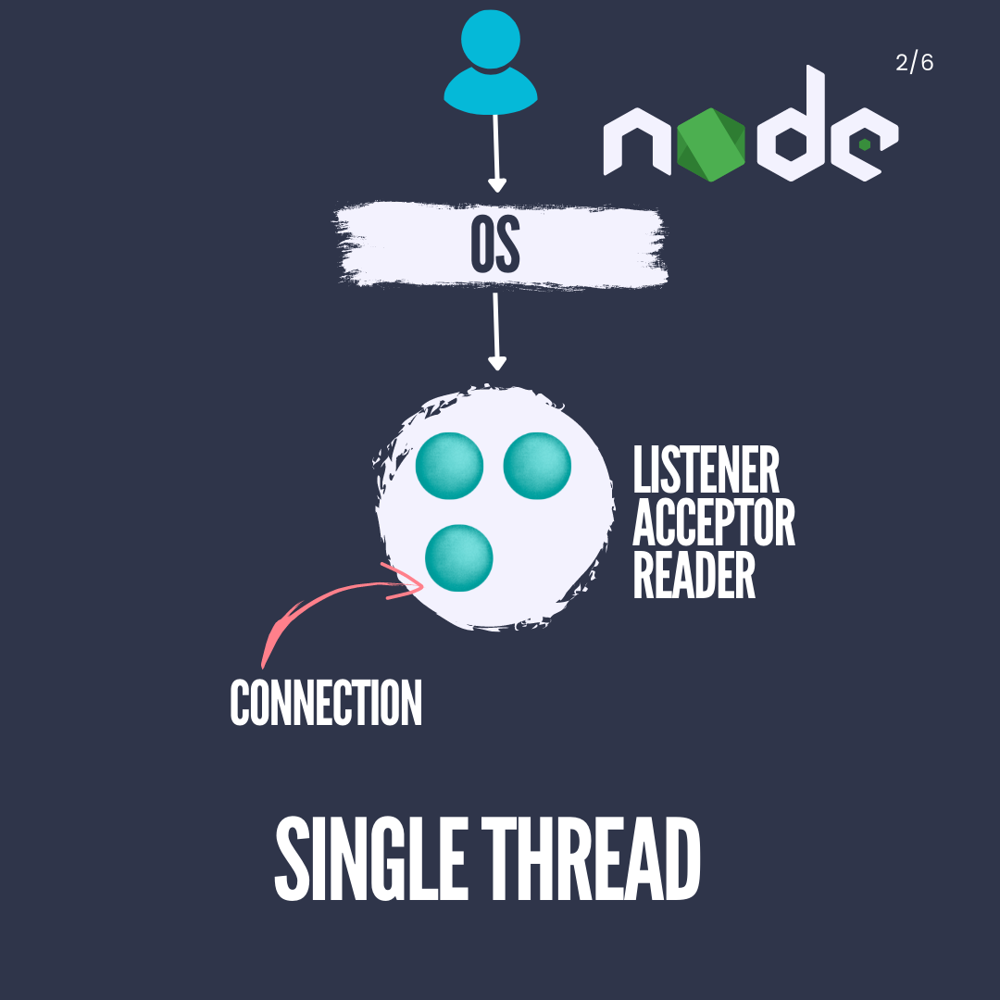
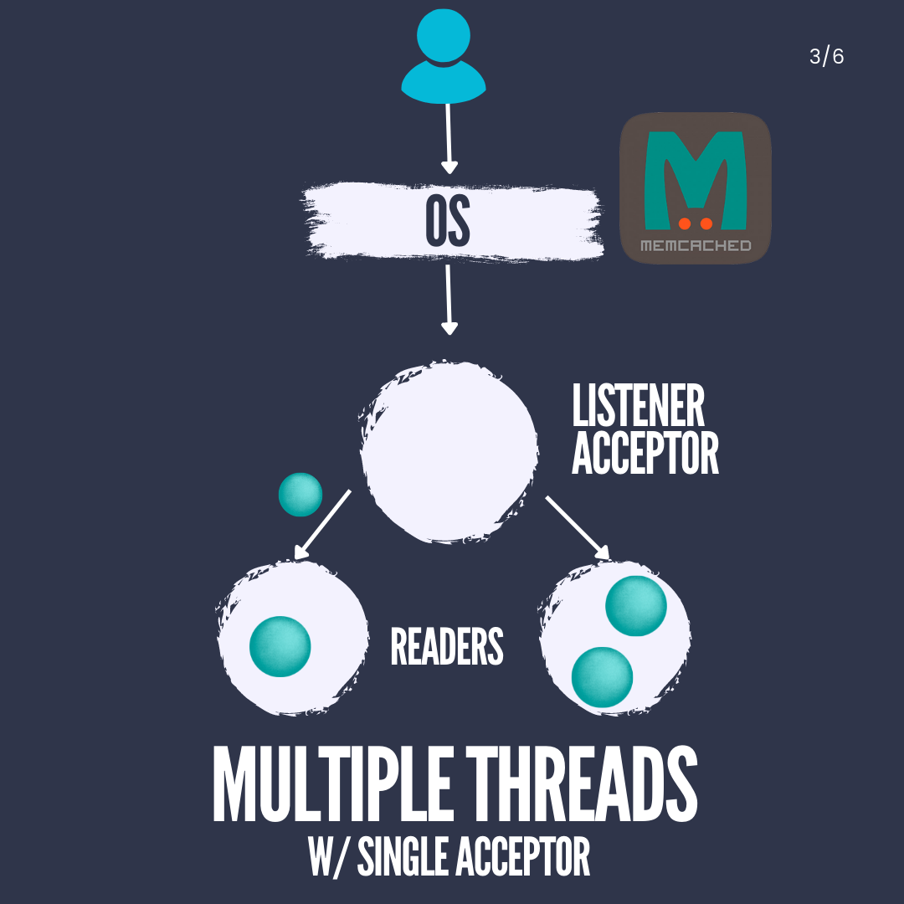
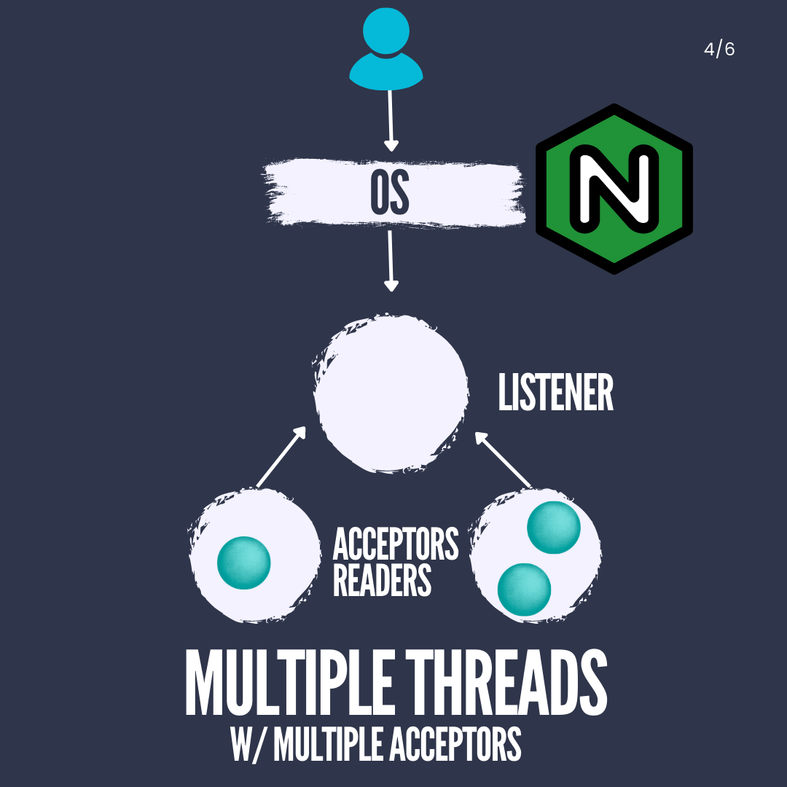
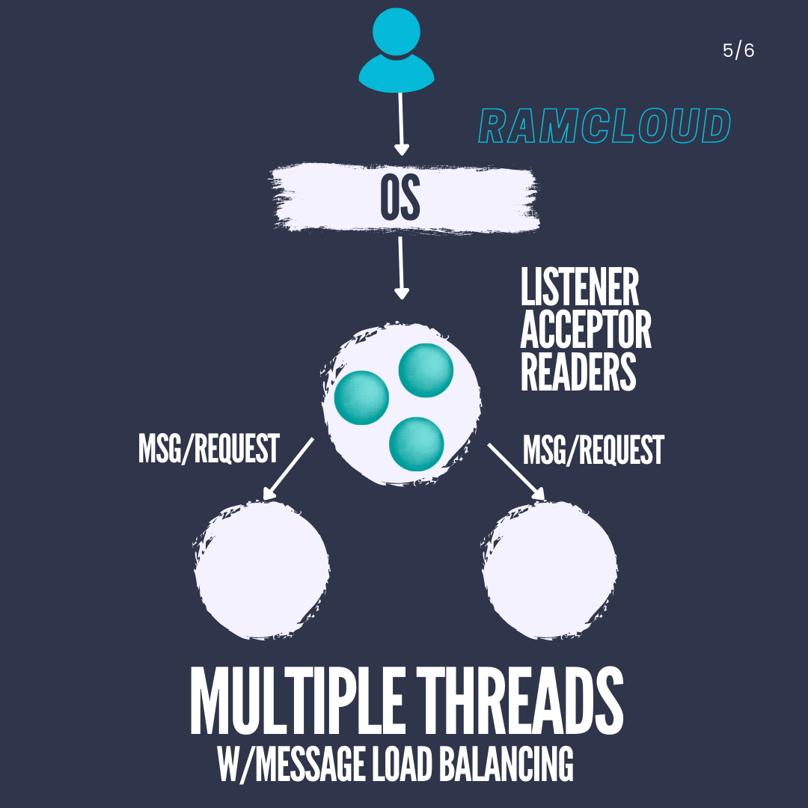
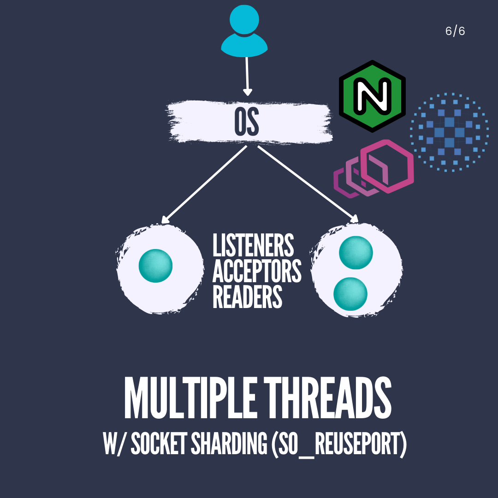

From [Threads and Connections in Backend Applications](https://medium.com/@hnasr/threads-and-connections-in-backend-applications-a225eed3eddb)

In networked backend applications employing TCP as the transport protocol, a variety of essential elements come into play:

**Fundamental Components:**

1. **Communication Protocol**:

    - _Definition_: TCP (Transmission Control Protocol) is a frequently chosen protocol for its dependable, connection-oriented communication.

2. **Port to Bind to**:

    - _Definition_: The backend application binds to a specific IP address and port, enabling it to listen for incoming connections.

3. **Process to Serve Requests and Produce Responses**:
    - _Definition_: The backend process is responsible for accepting incoming connections, reading data from them, processing the data to comprehend requests, and delivering suitable responses.

When dealing with TCP, the establishment of a stateful connection between the client and the backend is crucial. Before this connection can be established, the backend must actively accept incoming connections, as connections left unaccepted can accumulate in the operating system's backlog buffer.

**Key Roles and Definitions:**

1. **Listener**:

    - _Definition_: The listener is a component within the backend application that assumes the responsibility of generating a socket and actively listening on a specific IP address and port. It waits for incoming connection requests from clients.
    - _Analogy_: Think of it as an electrical wall socket into which devices (connections) can be plugged.

2. **Acceptor**:

    - _Definition_: The acceptor is either a thread or a process within the backend application that manages the task of accepting incoming connections. When a connection request arrives, the acceptor takes charge of the process.
    - _Function_: Its role encompasses calling the operating system's "accept" function to accept connections on behalf of the application.

3. **Reader** (or Worker):

    - _Definition_: The reader, often referred to as a worker, serves as a component responsible for reading data from an established connection. It processes the raw byte stream received over the TCP connection.
    - _Function_: It takes the file descriptor representing the connection and reads the data from the OS buffer, converting it into meaningful requests or messages for the application layer.

4. **TCP Stream**:

    - _Definition_: A TCP stream denotes the continuous flow of raw bytes transmitted between a client and a server over a TCP connection. It constitutes a sequence of data without clear boundaries or structure.
    - _Characteristics_: TCP, as a streaming protocol, does not define message boundaries or structure; instead, it delivers an uninterrupted stream of bytes.

5. **Requests** (in the context of TCP):
    - _Definition_: Requests, in this context, signify meaningful data or messages constructed from the raw TCP stream. This process involves parsing the stream to identify the commencement and conclusion of individual requests.
    - _Challenge_: Parsing raw bytes into requests can be intricate, especially in Layer 7 protocols like HTTP, HTTP/2, gRPC, and SSH, where messages possess distinct formats.

**Architectural Patterns:**

The management of these connections entails various architectural patterns, each revolving around the handling of threads and connections:

1. **Single Threaded Architecture**:

    - _Description_: This is a straightforward approach where the backend application operates on a single thread.
    - _Functionality_: This single thread performs tasks such as listening for incoming connections, accepting them, and reading data from these connections.
    - _Usage_: It is commonly employed in environments like Node.js, which achieves scalability by running multiple instances of this single-threaded application.

    

2. **Multiple Threads Single Acceptor Architecture**:

    - _Description_: This architecture leverages multithreading to harness the power of multiple CPU cores.
    - _Operation_: There is still a single thread responsible for listening and accepting connections.
    - _Handling Connections_: Each accepted connection is delegated to a separate thread, which manages the reading and processing of data.
    - _Considerations_: It's imperative to exercise caution to prevent excessive memory consumption due to thread creation and context switching.
    - _Example_: This approach mirrors the one used by memcached.

    

3. **Multiple Threads Multiple Acceptors Architecture**:

    - _Description_: This architecture bears similarities to the previous one but introduces a slight variation.
    - _Socket Placement_: The socket resides in shared memory accessible by multiple threads.
    - _Operation_: The listener thread spawns worker threads that independently call the accept function on the shared socket.
    - _Challenges_: Despite being an improvement over the single acceptor model, it may still encounter contention and blocking due to mutex usage.

    

4. **Multiple Threads with Message-based Load Balancing Architecture**:

    - _Description_: This architecture draws inspiration from protocols like Homa and finds use in systems like RAMCloud.
    - _Operation_: The listener thread focuses on accepting, reading, and parsing logical messages (requests) rather than raw connections.
    - _Load Balancing_: Parsed messages are subsequently distributed to worker threads for processing, facilitating load balancing.
    - _Considerations_: The listener thread might become a potential bottleneck as it juggles both connections and message parsing.

    

5. **Multiple Threads with Socket Sharding (SO_REUSEPORT)**:

    - _Description_: This approach circumvents the constraint of a single process binding to a port.
    - _Usage_: Multiple processes can listen on the same port by employing the SO_REUSEPORT socket option.
    - _Connection Handling_: Connections are allocated to these processes, and accept calls are no longer serialized.
    - _Adoption_: NGINX, Envoy, and HAProxy have embraced this approach.

    

It's crucial to recognize that these architectural patterns can be combined creatively to align with specific application requirements. For example, the fusion of socket sharding with message-based load balancing could yield enhanced performance and load distribution. Each pattern boasts its own merits and trade-offs, and the selection hinges on factors such as scalability demands, latency considerations, and the availability of hardware resources.
