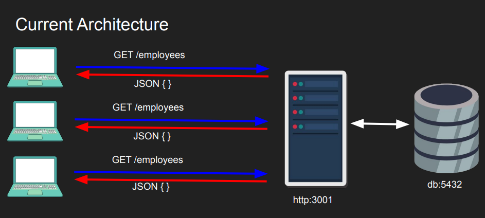

## Nginx Usecases

-   Web Server
    -   Serves web content
-   Reverse Proxy
    -   Load Balancing
    -   Backend Routing
    -   Caching
    -   API Gateway (rate limiting, API versioning, authentication)

## Nginx Implementation Example

| Before Nginx                                                                                                           | After Nginx                                                              |
| ---------------------------------------------------------------------------------------------------------------------- | ------------------------------------------------------------------------ |
|                                                                   |                       |
|                                                                                                                        |                                                                          |
| - The server can get overloaded as number of connections increase                                                      | Load balanced with Nginx, backend can scale independently                |
| - We can spin up multiple servers running on several ports but now the clients have to be aware of them too.           | Backend routing with Nginx                                               |
| - The endpoints are not secured, and with multiple servers multiple certificates need to be issued (or copied to each) | Can issue one certificate with Nginx, multiple certificates not required |
|                                                                                                                        |                                                                          |

_Nginx benefits don't come for free as it is an extra layer and there is some overhead, that is why Nginx or any reverse proxy has to be as efficient as possible._

## Nginx Layer 4 vs Layer 7 proxying

-   Layer 4/7 refers to OSI model layers.
-   In Layer 4 we see TCP/IP stack only nothing about the app, we have access to
    -   Source IP, Source Port
    -   Destination IP, Destination Port
    -   Simple packet inspection (SYN/TLS hello)
-   In Layer 7 we see the application, HTTP/ gRPC etc..
    -   We have access to more context
    -   I know where the client is going, which page they are visiting
    -   Require decryption
-   See [networking notes](../networking/) for more.
-   NGINX can operate in Layer 7 (e.g. http) or Layer 4 (tcp)
-   Layer 4 proxying is useful when NGINX doesn’t
    understand the protocol (MySQL database protocol)
-   Layer 7 proxying is useful when NGINX want to share
    backend connections and cache results
-   Using `stream` context it becomes a layer 4 proxy
-   Using `http` context it becomes a layer 7 proxy

## TLS Termination and TLS Passthrough

-   TLS stands for Transport Layer Security
-   It is a way to establish end-to-end encryption between one another
-   Symmetric encryption is used for communication (client/server has the
    same key)
-   Asymmetric encryption is used initially to exchange the symmetric key
    (diffie hellman)
-   Encryption alone, whether symmetric or asymmetric, doesn't guarantee the identity of communication parties. A middleman can pose as an authority, so Certificate Authorities (CAs) and verification methods are crucial for distinguishing between authorized and non-authorized entities, as encryption's primary role is content protection, not identity validation.
-   See [networking notes](../networking/) for more.

### TLS Termination

-   Even if NGINX has TLS (e.g. HTTPS) backend may or may not. For private server environment HTTP is fine if shielded by TLs at Nginx's layer. In this case NGINX terminates TLS, decrypts and sends unencrypted.
-   If NGINX is TLS and backend is also TLS ( HTTPS ). NGINX terminates TLS, decrypts, optionally rewrite headers and then re-encrypt the content to the backend. This introduces latency so the ciphers have to be fast and performant.
-   While NGINX can inspect Layer 7 (L7) data, rewrite headers, and cache content, it either needs to have its own SSL/TLS certificate or share the certificate used by the backend server. This certificate is essential for encrypting and decrypting data between NGINX and the backend.
-   Suitable for Load Balancing and Content Modification.
-   Shared Certificates for a Single Domain.

### TLS Passthrough

-   If the Backend has TLS, NGINX can be used to just to proxy/stream the packets directly to the backend. In this case Nginx doesn't respond to the 'TLS Hello' as it is not authorized to terminate TLS. The TLS handshake is forwarded all the way to the backend just like a tunnel and back.
-   There is no caching
-   There are L4 check only, but more secure as NGINX doesn’t need
    the backend certificate.
-   Preferred for End-to-End Encryption and Enhanced Security.
-   Appropriate When Content Inspection or Modification Is Not Required.
-   One disadvantage is that Nginx cannot share backend connections, every request will have a new connection and that can be costly.
