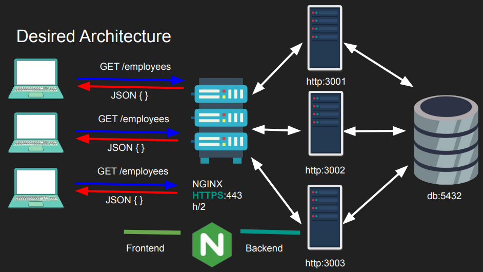
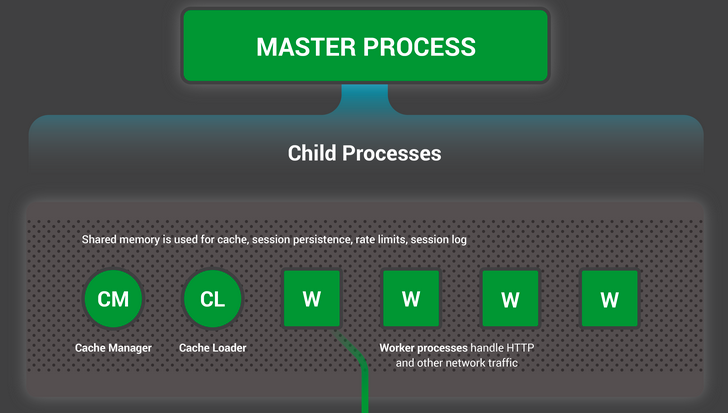
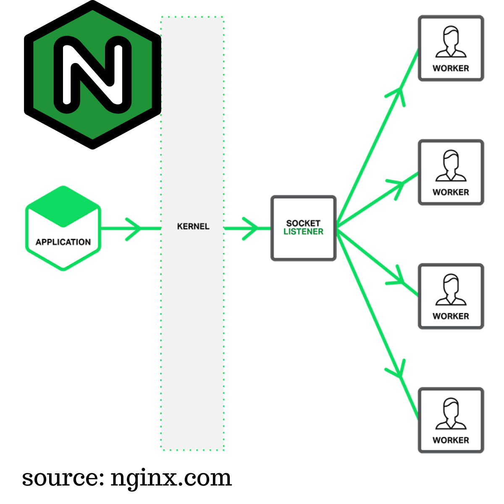
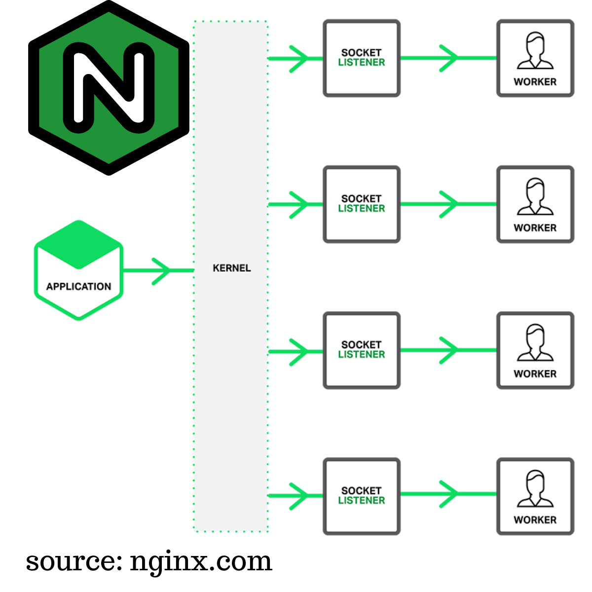

## Nginx Usecases

-   Web Server
    -   Serves web content
-   Reverse Proxy
    -   Load Balancing
    -   Backend Routing
    -   Caching
    -   API Gateway (rate limiting, API versioning, authentication)

## Nginx Implementation Example

| Before Nginx                                                                                                           | After Nginx                                                              |
| ---------------------------------------------------------------------------------------------------------------------- | ------------------------------------------------------------------------ |
|                                                                         |                             |
|                                                                                                                        |                                                                          |
| - The server can get overloaded as number of connections increase                                                      | Load balanced with Nginx, backend can scale independently                |
| - We can spin up multiple servers running on several ports but now the clients have to be aware of them too.           | Backend routing with Nginx                                               |
| - The endpoints are not secured, and with multiple servers multiple certificates need to be issued (or copied to each) | Can issue one certificate with Nginx, multiple certificates not required |
|                                                                                                                        |                                                                          |

_Nginx benefits don't come for free as it is an extra layer and there is some overhead, that is why Nginx or any reverse proxy has to be as efficient as possible._

## Nginx Layer 4 vs Layer 7 proxying

-   Layer 4/7 refers to OSI model layers.
-   In Layer 4 we see TCP/IP stack only nothing about the app, we have access to
    -   Source IP, Source Port
    -   Destination IP, Destination Port
    -   Simple packet inspection (SYN/TLS hello)
-   In Layer 7 we see the application, HTTP/ gRPC etc..
    -   We have access to more context
    -   I know where the client is going, which page they are visiting
    -   Require decryption
-   See [networking notes](../networking/) for more.
-   NGINX can operate in Layer 7 (e.g. http) or Layer 4 (tcp)
-   Layer 4 proxying is useful when NGINX doesn’t
    understand the protocol (MySQL database protocol)
-   Layer 7 proxying is useful when NGINX want to share
    backend connections and cache results
-   Using `stream` context it becomes a layer 4 proxy
-   Using `http` context it becomes a layer 7 proxy

## TLS Termination and TLS Passthrough

-   TLS stands for Transport Layer Security
-   It is a way to establish end-to-end encryption between one another
-   Symmetric encryption is used for communication (client/server has the
    same key)
-   Asymmetric encryption is used initially to exchange the symmetric key
    (diffie hellman)
-   Encryption alone, whether symmetric or asymmetric, doesn't guarantee the identity of communication parties. A middleman can pose as an authority, so Certificate Authorities (CAs) and verification methods are crucial for distinguishing between authorized and non-authorized entities, as encryption's primary role is content protection, not identity validation.
-   See [networking notes](../networking/) for more.

### TLS Termination

-   Even if NGINX has TLS (e.g. HTTPS) backend may or may not. For private server environment HTTP is fine if shielded by TLs at Nginx's layer. In this case NGINX terminates TLS, decrypts and sends unencrypted.
-   If NGINX is TLS and backend is also TLS ( HTTPS ). NGINX terminates TLS, decrypts, optionally rewrite headers and then re-encrypt the content to the backend. This introduces latency so the ciphers have to be fast and performant.
-   While NGINX can inspect Layer 7 (L7) data, rewrite headers, and cache content, it either needs to have its own SSL/TLS certificate or share the certificate used by the backend server. This certificate is essential for encrypting and decrypting data between NGINX and the backend.
-   Suitable for Load Balancing and Content Modification.
-   Shared Certificates for a Single Domain.

### TLS Passthrough

-   If the Backend has TLS, NGINX can be used to just to proxy/stream the packets directly to the backend. In this case Nginx doesn't respond to the 'TLS Hello' as it is not authorized to terminate TLS. The TLS handshake is forwarded all the way to the backend just like a tunnel and back.
-   There is no caching
-   There are L4 check only, but more secure as NGINX doesn’t need
    the backend certificate.
-   Preferred for End-to-End Encryption and Enhanced Security.
-   Appropriate When Content Inspection or Modification Is Not Required.
-   One disadvantage is that Nginx cannot share backend connections, every request will have a new connection and that can be costly.

## Nginx Internal Architecture

-   Nginx has a 'master process' that coordinates all other Nginx processes. It also manages caching, reading it from disk, and refreshing caches.
-   The primary focus is on 'worker processes', responsible for most of the work. Worker processes handle connections and requests.

    

-   When Nginx is in 'auto' mode, worker processes are spawned based on the number of hardware threads on the server. Hardware threads can simulate multiple cores (with [hyper-threading](https://www.intel.com/content/www/us/en/gaming/resources/hyper-threading.html)), e.g., 4 cores can simulate 8 hardware threads.

-   **NGINX Threading Architecture**

    -   When NGINX reverse proxy starts it creates one thread per CPU core and these worker threads do the heavy lifting. The number of worker threads are configurable but NGINX recommends one thread per CPU core to avoid context switching and cache thrashing. In older versions of NGINX all threads accept connections by competing on the shared listener socket (by default only one process can listen on IP/port pair). In recent versions of NGINX this was changed to use socket sharding (through SO_REUSEPORT socket option) which allows multiple threads to listen on the same port and the OS will load balance connections on each accept queue.

    | Multiple Threads Single Acceptor Architecture                                                     | Multiple Threads with Socket Sharding (SO_REUSEPORT)                                                          |
    | ------------------------------------------------------------------------------------------------- | ------------------------------------------------------------------------------------------------------------- |
    |  |  |

    See more at [Threads And Connections In The Backend](../networking/threads-and-connections-in-the-backend.html)

-   When a client establishes a TCP connection to Nginx, connections are initially placed in a Syn queue and then moved to an accept queue. The kernel manages the queue but it's allocated by Nginx.

-   Worker processes retrieve connections from the accept queue. Worker processes are responsible for request handling. Each worker process is pinned to a CPU core to minimize context switches as Request handling involves CPU-intensive tasks.

-   Some requests are IO bound, requiring reading content from disk, making upstream network requests or writing to sockets(i.e writing a response which may also involve encryption). These IO-bound operations can be slow and cause waits, hence Nginx performs event-driven IO, allowing the process to perform other tasks during IO wait.

-   Nginx scales by adding more worker processes to handle incoming connections. Each worker process can manage multiple connections simultaneously. Load balancing distributes connections among worker processes. The number of worker processes depends on server hardware and usage patterns.

See also [How Nginx is Designed for Performance and Scale](https://www.nginx.com/blog/inside-nginx-how-we-designed-for-performance-scale/)

## Nginx Timeouts

In Nginx, timeouts are settings that determine how long the server should wait for certain events to occur before considering them as failures. It is critical to ensure efficient use of resources so you don't let a runaway process run for a very long time and consume all the resources and then the client keeps waiting.

### Frontend Timeouts (when clients talk to Nginx)

1. **client_header_timeout:**

    - **Description:** `client_header_timeout` specifies the maximum time Nginx will wait for a client to send the request header, including request method, URI, and HTTP headers.
    - **Use Case:** It's valuable in ensuring that clients send their request headers within an acceptable time frame, preventing slow or unresponsive clients from tying up server resources.
    - **Benefit:** Enhances server performance by managing slow or misbehaving clients effectively and preventing resource exhaustion.
    - **Status Code:** 408 Request Timeout (if exceeded)
    - **Default Value:** 60s

2. **client_body_timeout:**

    - **Description:** This timeout determines how long Nginx waits for the client to send the request body, commonly used for HTTP POST requests that include data.
    - **Use Case:** In scenarios where clients submit forms, upload files, or provide data via POST requests, `client_body_timeout` ensures timely receipt of this data.
    - **Benefit:** Prevents connections from remaining open indefinitely for slow clients, optimizing server resource usage and responsiveness.
    - **Status Code:** 408 Request Timeout (if exceeded)
    - **Default Value:** 60s

3. **send_timeout:**

    - **Description:** `send_timeout` specifies the maximum time Nginx waits to send data to the client once the response has started.
    - **Use Case:** In applications like live streaming or real-time communication, timely data delivery is essential for a smooth user experience.
    - **Benefit:** Ensures that data is sent to clients promptly, preventing long delays and potential client-side timeouts, crucial for real-time applications.
    - **Status Code:** 408 Request Timeout (if exceeded)
    - **Default Value:** 60s

4. **keepalive_timeout:**

    - **Description:** This timeout defines how long Nginx keeps a client connection open for potential reuse, allowing multiple requests over the same connection.
    - **Use Case:** In websites serving multiple assets (HTML, CSS, JavaScript, images) on a single page, reusing connections reduces latency and improves load times.
    - **Benefit:** Reduces connection overhead and improves performance by reusing connections for multiple requests from the same client.
    - **Status Code:** Not applicable (connection management)
    - **Default Value:** 75s

5. **lingering_timeout:**

    - **Description:** `lingering_timeout` determines how long Nginx keeps a closed ([lingering_close](http://nginx.org/en/docs/http/ngx_http_core_module.html#lingering_close)) client connection open to handle late responses. It is used in cases where Nginx serves cached responses and needs to close the connection gracefully.
    - **Use Case:** Useful for serving cached content and ensuring that clients receive responses even if the connection is closed before the server generates the entire response.
    - **Benefit:** Provides a better user experience by allowing clients to receive cached content despite a closed connection, reducing the need for new connections.
    - **Status Code:** Not applicable (connection management)
    - **Default Value:** 5s

6. **resolver_timeout:**
    - **Description:** `resolver_timeout` sets the maximum time Nginx will wait for DNS resolution when proxying requests to upstream servers.
    - **Use Case:** When Nginx acts as a reverse proxy and needs to resolve the DNS of upstream servers, this timeout ensures that DNS resolution doesn't cause delays.
    - **Benefit:** Prevents unnecessary delays in request processing due to slow DNS resolution, ensuring timely delivery of content.
    - **Status Code:** 408 Request Timeout (if exceeded)
    - **Default Value:** 30s

### Backend Timeouts (when Nginx talks to backends)

1. **proxy_connect_timeout:**

    - **Description:** `proxy_connect_timeout` specifies the maximum time Nginx waits to establish a connection with a backend server.
    - **Use Case:** In a reverse proxy configuration, it helps Nginx quickly identify unresponsive backend servers.
    - **Benefit:** Ensures that clients are not left waiting indefinitely for content from a problematic backend, improving reliability.
    - **Status Code:** 502 Bad Gateway (if exceeded)
    - **Default Value:** 60s

2. **proxy_send_timeout:**

    - **Description:** This timeout defines the maximum time Nginx waits to send data to the backend server after a connection is established.
    - **Use Case:** In applications like e-commerce platforms, where requests are forwarded to backend systems for order processing.
    - **Benefit:** Prevents bottlenecks caused by slow or unresponsive backend servers, maintaining responsiveness for clients and preventing request queuing or timeouts.
    - **Status Code:** 502 Bad Gateway (if exceeded)
    - **Default Value:** 60s

3. **proxy_read_timeout:**

    - **Description:** Specifies the maximum time Nginx waits for a response from the backend server.
    - **Use Case:** Content-heavy websites fetching data from backend databases or applications that rely on various backend services.
    - **Benefit:** Ensures that clients receive timely responses, preventing unnecessary delays and potential client-side timeouts due to backend issues.
    - **Status Code:** 504 Gateway Timeout (if exceeded)
    - **Default Value:** 60s

4. **proxy_next_upstream_timeout:**

    - **Description:** `proxy_next_upstream_timeout` sets the maximum time Nginx waits for a response from the next upstream server in case the current one fails.
    - **Use Case:** In load-balanced configurations, it allows Nginx to quickly switch to a backup server if the primary one fails to respond.
    - **Benefit:** Improves fault tolerance and availability by minimizing downtime in case of upstream server failures.
    - **Status Code:** 502 Bad Gateway (if exceeded)
    - **Default Value:** 0s

5. **keepalive_timeout:**
    - **Description:** Already discussed in the frontend section, `keepalive_timeout` also plays a role on the backend for reusing connections between Nginx and upstream servers.
    - **Use Case:** Helps in maintaining efficient and persistent connections to backend servers, reducing connection overhead.
    - **Benefit:** Reduces the need to frequently establish new connections to upstream servers, improving performance and reducing latency.
    - **Status Code:** Not applicable (connection management)
    - **Default Value:** 75s

Configuring these timeouts accurately based on your specific use cases is vital for optimizing the performance, reliability, and responsiveness of your Nginx web server or reverse proxy while ensuring efficient resource management and graceful handling of client and backend server interactions.

## Nginx Configuration

**Understanding Nginx Configuration Contexts:**
- Nginx configuration is organized into a tree-like structure using curly braces `{}` to define contexts.
- Contexts group configuration directives based on their area of concern.
- Contexts can be nested, allowing for inheritance of configurations.

**Core Contexts:**

1. **Main Context:**
   - The top-level context that affects the entire application.
   - Configures system user, worker processes, error files, and more.

   **Example:**
   ```nginx
   user www-data;
   worker_processes auto;
   error_log /var/log/nginx/error.log;
   ```

2. **Events Context:**
   - Nested within the `main` context.
   - Sets global options for handling connections.
   - Controls connection processing techniques.

   **Example:**
   ```nginx
   events {
       worker_connections 1024;
       use epoll;
   }
   ```

3. **HTTP Context:**
   - Nested within the `main` context.
   - The primary context for web server configuration.
   - Contains directives for handling HTTP or HTTPS connections.

   **Example:**
   ```nginx
   http {
       server_names_hash_bucket_size 64;
       access_log /var/log/nginx/access.log;
   }
   ```

4. **Server Context:**
   - Nested within the `http` context.
   - Defines virtual servers for handling specific requests.
   - Selects a server based on IP/port and host name.

   **Example:**
   ```nginx
   server {
       listen 80;
       server_name example.com;
       location / {
           # Server configuration here
       }
   }
   ```

5. **Location Context:**
   - Nested within server contexts.
   - Used to handle requests based on the request URI.
   - Contains directives for specific location-based processing.

   **Example:**
   ```nginx
   location /static/ {
       alias /var/www/static/;
   }
   ```

**Other Contexts (Less Common):**
- `split_clients`, `perl`, `map`, `geo`, `types`, `charset_map`: These contexts have specific use cases and are used less frequently.

**Upstream Context:**
- Used to define and configure upstream servers for proxying requests.
- Enables load balancing when proxying requests.

   **Example:**
   ```nginx
   upstream backend {
       server backend1.example.com;
       server backend2.example.com;
   }
   ```

**If Context:**
- Provides conditional processing of directives.
- Should be used with caution, as it can lead to unexpected results.
- Typically used with `return` and `rewrite` directives.

   **Example:**
   ```nginx
   if ($request_uri ~* "admin") {
       return 403;
   }
   ```

**Limit_except Context:**
- Restricts the use of certain HTTP methods within a location context.
- Useful for controlling access to specific methods based on client characteristics.

   **Example:**
   ```nginx
   location /restricted-write {
       limit_except GET HEAD {
           allow 192.168.1.1/24;
           deny all;
       }
   }
   ```

**General Rules for Contexts:**
- Apply directives in the highest context available to avoid repetition.
- Utilize multiple sibling contexts instead of using `if` logic for processing.
- Favor purpose-made directives over `if` for better performance and reliability.
